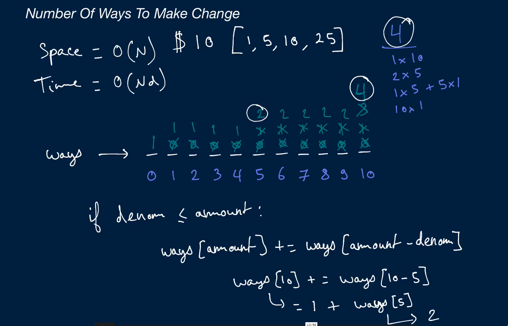

## Number Of Ways To Make Change

  Given an array of distinct positive integers representing coin denominations and a
  single non-negative integer n representing a target amount of
  money, write a function that returns the number of ways to make change for
  that target amount using the given coin denominations.

  Note that an unlimited amount of coins is at your disposal.

## Sample Input</h3>

<pre>
  n = 6
  denoms = [1, 5]
</pre>

## Sample Output</h3>

<pre>
  2 // 1x1 + 1x5 and 6x1
</pre>

## Hint 1

  Try building an array of the number of ways to make change for all amounts between 0 and n inclusive. Note that there is only one way to make change for 0: that is to not use any coins.

## Hint 2

  Build up the array mentioned in Hint #1 one coin denomination at a time. In other words, find the number of ways to make change for all amounts between 0 and n with only one denomination, then with two, etc., until you use all denominations.

## Optimal Space & Time Complexity

  O(nd) time | O(n) space - where n is the target amount and d is the number of coin denominations
