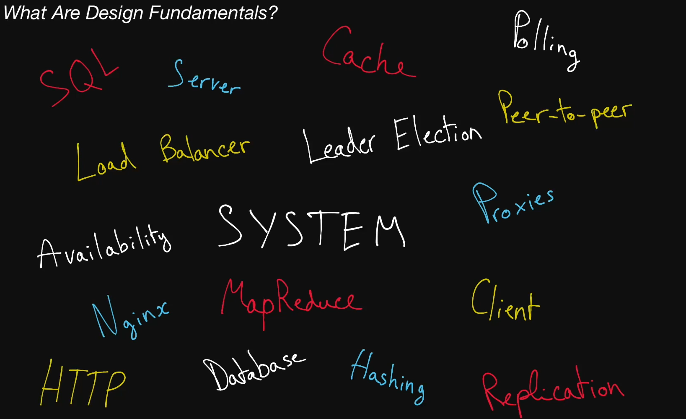

# What Are Design Fundamentals?

> Building scalable, production-ready applications is both art and science. Science,  
> in that it requires knowledge of many topics in computer engineering; art, in that  
> it demands an eye for making smart design choices and piecing together the right technologies.  

> Master both disciplines and you, too, can become a Systems Expert.

## We can divide design fundamentals into 4 categories

* 1. Foundational design knowledge like:
Client-server model, Network protocols.

* 2. Key characteristics of systems:
Availability, latency, redundancy, consistency.

* 3. Actual components of a system:
Proxies, caches, leader election, load balancer.

* 4. Tech: A real product that you can use to build your system.
Nginx, Google cloud storage, Amazon S3, Redis
