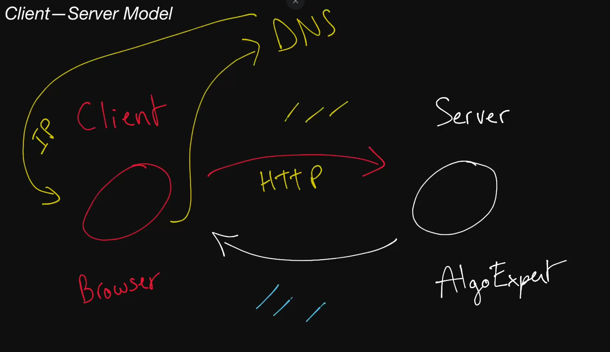

# Client—Server Model

A client is a thing that talks to servers.
A server is a thing that talks to clients.
The client—server model is a thing made up of a
bunch of clients and servers talking to one another.

## Client

  A machine or process that requests data or service from a server.

  Note that a single machine or piece of software can be both a client and a
  server at the same time. For instance, a single machine could act as a server
  for end users and as a client for a database.

## Server

  A machine or process that provides data or service for a client, usually by
  listening for incoming network calls.

  Note that a single machine or piece of software can be both a client and a
  server at the same time. For instance, a single machine could act as a server
  for end users and as a client for a database.

## Client—Server Model

  The paradigm by which modern systems are designed, which consists of clients
  requesting data or service from servers and servers providing data or service
  to clients.

## IP Address

  An address given to each machine connected to the public internet. IPv4
  addresses consist of four numbers separated by dots: <b>a.b.c.d</b> where all
  four numbers are between 0 and 255. Special values include:

    127.0.0.1: Your own local machine. Also referred to as
    localhost

    192.168.x.y: Your private network. For instance, your machine and all
    machines on your private wifi network will usually have the
    192.168 prefix.

## Port

  In order for multiple programs to listen for new network connections on the
  same machine without colliding, they pick a <b>port</b> to listen on. A port
  is an integer between 0 and 65,535 (216 ports total).

  Typically, ports 0-1023 are reserved for <i>system ports</i> (also called
  <i>well-known</i> ports) and shouldn't be used by user-level processes.
  Certain ports have pre-defined uses, and although you usually won't be
  required to have them memorized, they can sometimes come in handy. Below are
  some examples:

  22: Secure Shell
  53: DNS lookup
  80: HTTP
  443: HTTPS

## DNS

Short for Domain Name System, it describes the entities and protocols involved in the
translation from domain names to IP Addresses. Typically, machines make a DNS query to
a well known entity which is responsible for returning the IP address (or multiple ones)
of the requested domain name in the response.

# Notes

* A client is a machine that request data to the server
  * The browser is the clien
  * The client don't know what the server represent
  * The clien uses the DNS to query to find the IP address
  * Send a HTTP request to the server

* The server is a machine that speak back to the clien, sending data
  * let's use Google cloud platform
  * A server listen for request in specific port
  * If a cliennt uses HTTP request the default port is 80
  * You can test talking to a computer opening 2 command line in one type:
   `nc -l 8081`, on the other
   `nc 127.0.0.1 8081`, try writting someting you will seet in the other cammand line.
