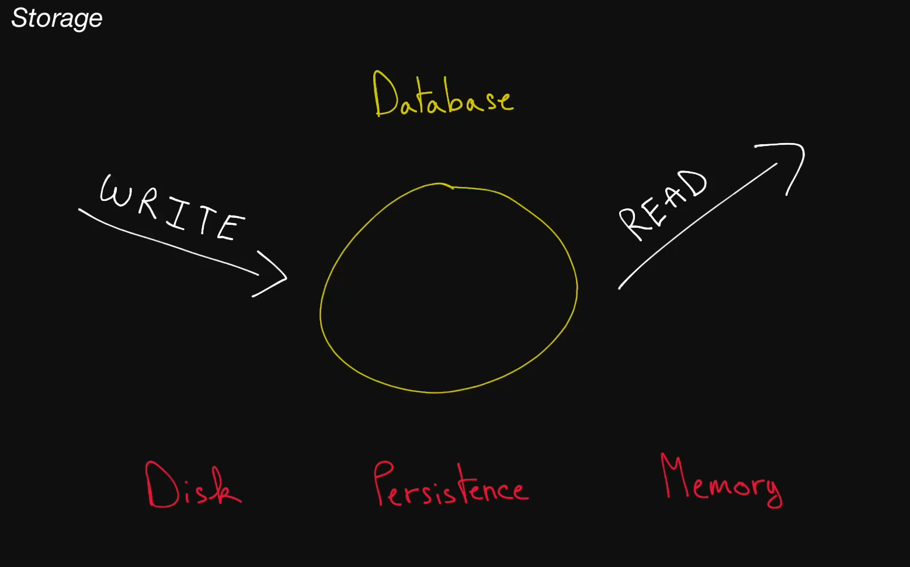

# storage

As it turns out, information storage is an incredibly complex topic that is of vital importance to systems design.

# Notes

* Databases
  * store data
  * reading data
  * writting data
  * is just a server
  * you can make your computer a database

* Disk
  * writting data to disk is saved even if there's any issue

* Memory
  * writing or reading data to memory is fasterr
