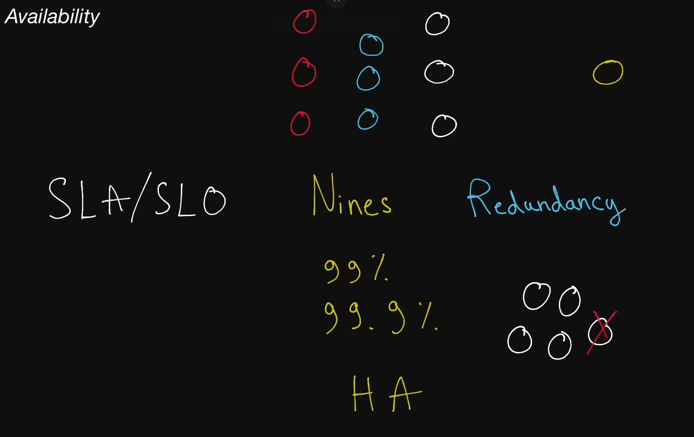

# Availability

  The odds of a particular server or service being up and running at any point
  in time, usually measured in percentages. A server that has 99% availability
  will be operational 99% of the time (this would be described as having two
  <b>nines</b> of availability).

## High Availability

  Used to describe systems that have particularly high levels of availability,
  typically 5 nines or more; sometimes abbreviated "HA".

## Nines

  Typically refers to percentages of uptime. For example, 5 nines of
  availability means an uptime of 99.999% of the time. Below are the downtimes
  expected per year depending on those 9s:

<pre>
- 99% (two 9s): 87.7 hours
- 99.9% (three 9s): 8.8 hours
- 99.99%: 52.6 minutes
- 99.999%: 5.3 minutes
</pre>

## Redundancy

  The process of replicating parts of a system in an effort to make it more
  reliable.

## SLA

  Short for "service-level agreement", an SLA is a collection of guarantees
  given to a customer by a service provider. SLAs typically make guarantees on a
  system's availability, amongst other things. SLAs are made up of one or
  multiple SLOs.

## SLO

  Short for "service-level objective", an SLO is a guarantee given to a customer
  by a service provider. SLOs typically make guarantees on a system's
  availability, amongst other things. SLOs constitute an SLA.
