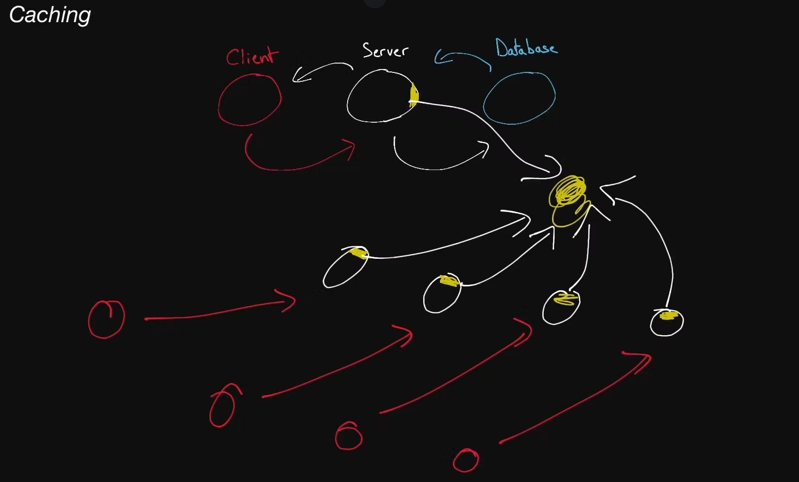

# Cache

  A piece of hardware or software that stores data, typically meant to retrieve
  that data faster than otherwise.

  Caches are often used to store responses to network requests as well as
  results of computationally-long operations.

  Note that data in a cache can become <b>stale</b> if the main source of truth
  for that data (i.e., the main database behind the cache) gets updated and the
  cache doesn't.

## Cache Hit

When requested data is found in a cache.

## Cache Miss

  When requested data could have been found in a cache but isn't. This is
  typically used to refer to a negative consequence of a system failure or of a
  poor design choice. For example:

    If a server goes down, our load balancer will have to forward requests to a
    new server, which will result in cache misses.

## Cache Eviction Policy

  The policy by which values get evicted or removed from a cache. Popular cache
  eviction policies include <b>LRU</b> (least-recently used), <b>FIFO</b> (first
  in first out), and <b>LFU</b> (least-frequently used).

## Content Delivery Network

  A <b>CDN</b> is a third-party service that acts like a cache for your servers.
  Sometimes, web applications can be slow for users in a particular region if
  your servers are located only in another region. A CDN has servers all around
  the world, meaning that the latency to a CDN's servers will almost always be
  far better than the latency to your servers. A CDN's servers are often referred
  to as <b>PoPs</b> (Points of Presence). Two of the most popular CDNs are
  <b>Cloudflare</b> and <b>Google Cloud CDN</b>.
