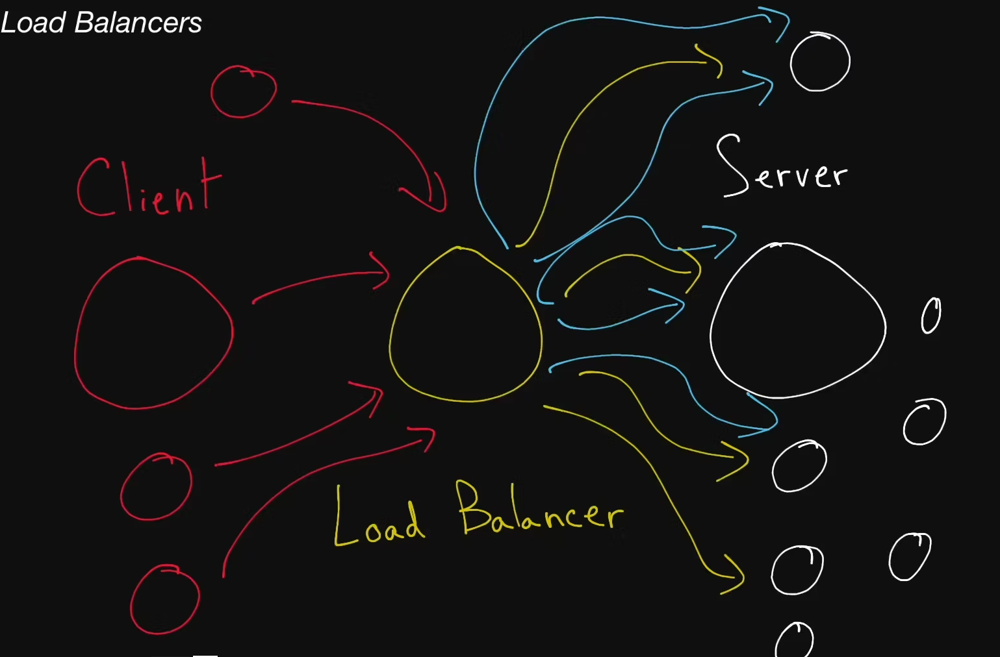

# Load Balancers

Relentlessly distributing network requests across multiple servers, these digital traffic cops act as watchful guardians for your system, ensuring that it operates at peak performance day and night.

## Load Balancer

  A type of <b>reverse proxy</b> that distributes traffic across servers. Load
  balancers can be found in many parts of a system, from the DNS layer all the
  way to the database layer.

## Server-Selection Strategy

  How a <b>load balancer</b> chooses servers when distributing traffic amongst
  multiple servers. Commonly used strategies include round-robin, random
  selection, performance-based selection (choosing the server with the best
  performance metrics, like the fastest response time or the least amount of
  traffic), and IP-based routing.

## Hot Spot

  When distributing a workload across a set of servers, that workload might be
  spread unevenly. This can happen if your <b>sharding key</b> or your <b>hashing function</b>
  are suboptimal, or if your workload is naturally skewed: some servers will
  receive a lot more traffic than others, thus creating a "hot spot".

## Nginx

  Pronounced "engine X"—not "N jinx", Nginx is a very popular webserver that's
  often used as a <b>reverse proxy</b> and <b>load balancer</b>.
