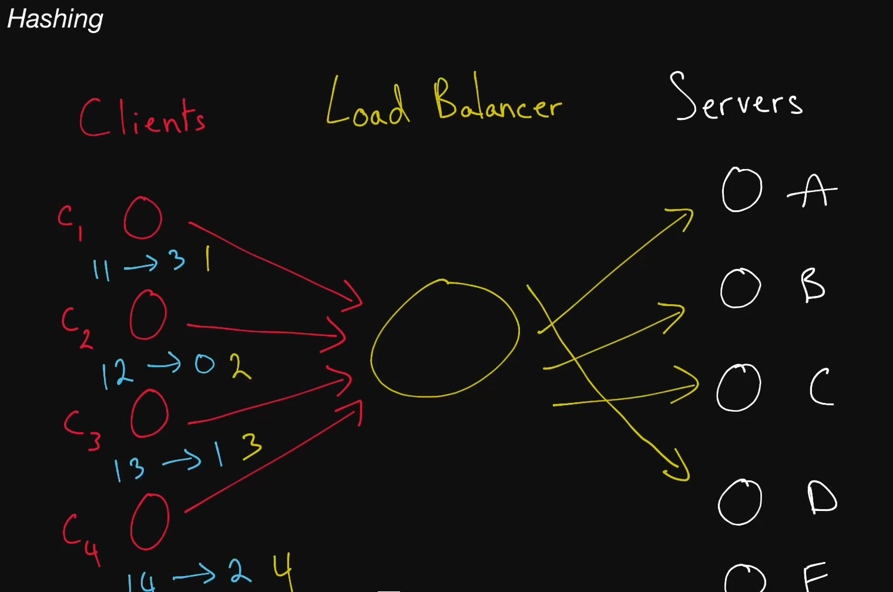
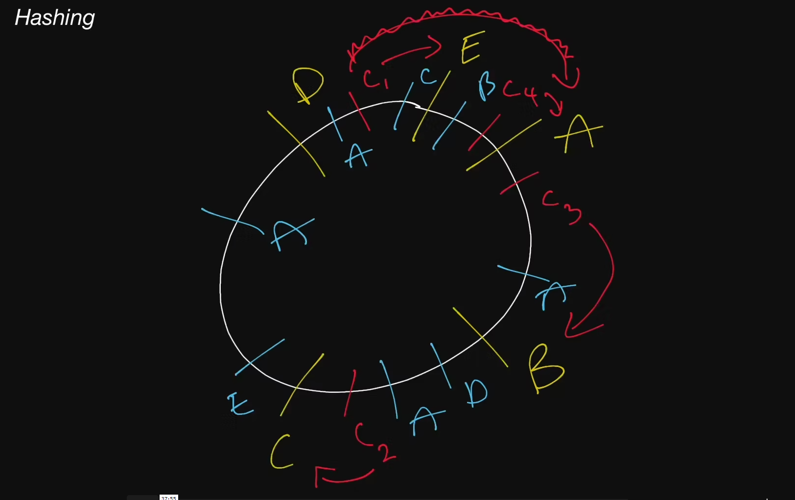

# Hashing

Hashing? Like from hash tables?
Should be simple enough, right?

The good news is that, yes, hashing like from hash tables.

The bad news is that, no, not simple enough.

## Inconsistem hashing

## Consistent Hashing

  A type of hashing that minimizes the number of keys that need to be remapped
  when a hash table gets resized. It's often used by load balancers to
  distribute traffic to servers; it minimizes the number of requests that get
  forwarded to different servers when new servers are added or when existing
  servers are brought down.

## Rendezvous Hashing

  A type of hashing also coined <b>highest random weight</b> hashing. Allows for
  minimal re-distribution of mappings when a server goes down.

## SHA

  Short for "Secure Hash Algorithms", the SHA is a collection of cryptographic
  hash functions used in the industry. These days, SHA-3 is a popular choice to
  use in a system.
