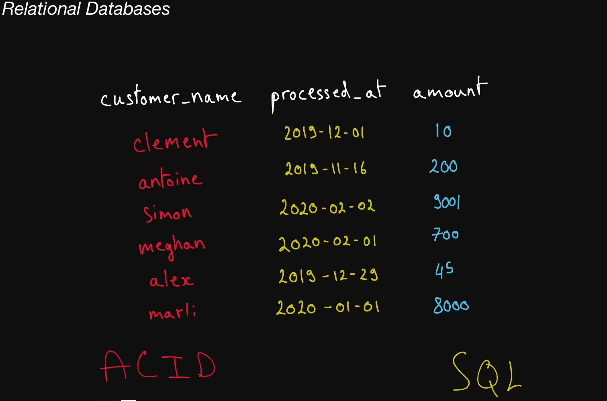

# Relational Databases

  A type of structured database in which data is stored following a tabular
  format; often supports powerful querying using SQL.

## Non-Relational Database

  In contrast with relational database (SQL databases), a type of database that
  is free of imposed, tabular-like structure. Non-relational databases are often
  referred to as NoSQL databases.

## SQL

  Structured Query Language. Relational databases can be used using a derivative
  of SQL such as PostgreSQL in the case of Postgres.

## SQL Database

  Any database that supports SQL. This term is often used synonymously with
  "Relational Database", though in practice, not <i>every</i> relational
  database supports SQL.

## NoSQL Database

Any database that is not SQL-compatible is called NoSQL.

## ACID Transaction

  A type of database transaction that has four important properties:

  <b>Atomicity</b>: The operations that constitute the transaction will either
  all succeed or all fail. There is no in-between state.

  <b>Consistency</b>: The transaction cannot bring the database to an invalid
  state. After the transaction is committed or rolled back, the rules for each
  record will still apply, and all future transactions will see the effect of
  the transaction. Also named <b>Strong Consistency</b>.

  <b>Isolation</b>: The execution of multiple transactions concurrently will
  have the same effect as if they had been executed sequentially.

  <b>Durability</b>: Any committed transaction is written to non-volatile
  storage. It will not be undone by a crash, power loss, or network partition.

## Database Index

  A special auxiliary data structure that allows your database to perform
  certain queries much faster. Indexes can typically only exist to reference
  structured data, like data stored in relational databases. In practice, you
  create an index on one or multiple columns in your database to greatly speed
  up <b>read</b> queries that you run very often, with the downside of slightly
  longer <b>writes</b> to your database, since writes have to also take place in
  the relevant index.

## Strong Consistency

Strong Consistency usually refers to the consistency of ACID transactions, as opposed to <b>Eventual Consistency</b>.

## Eventual Consistency

  A consistency model which is unlike <b>Strong Consistency</b>. In this model,
  reads might return a view of the system that is stale. An eventually
  consistent datastore will give guarantees that the state of the database will
  eventually reflect writes within a time period (could be 10 seconds, or
  minutes).

## Postgres

  A relational database that uses a dialect of SQL called PostgreSQL. Provides
  ACID transactions.
