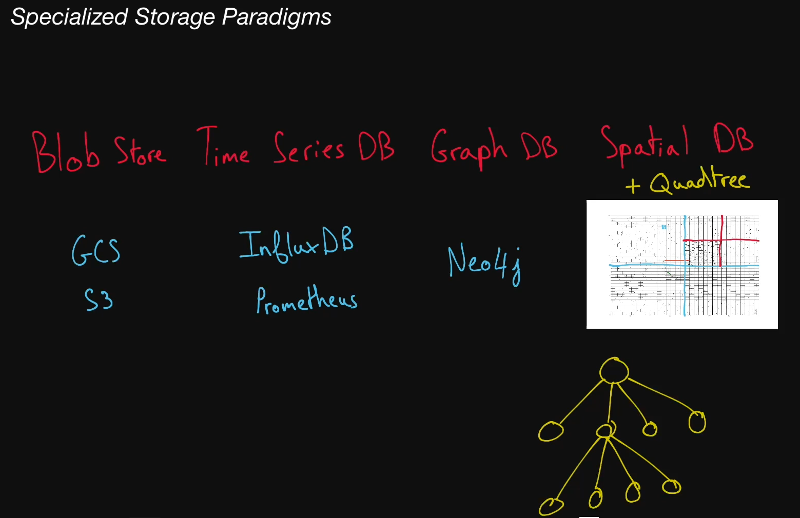

# Specialized Storage Paradigms

## Blob Storage

  Widely used kind of storage, in small and large scale systems. They don’t
  really count as databases per se, partially because they only allow the user
  to store and retrieve data based on the name of the blob. This is sort of like
  a key-value store but usually blob stores have different guarantees. They
  might be slower than KV stores but values can be megabytes large (or sometimes
  gigabytes large). Usually people use this to store things like
  <b>large binaries, database snapshots, or images</b> and other static assets
  that a website might have.

  Blob storage is rather complicated to have on premise, and only giant
  companies like Google and Amazon have infrastructure that supports it. So
  usually in the context of System Design interviews you can assume that you
  will be able to use <b>GCS</b> or <b>S3</b>. These are blob storage services
  hosted by Google and Amazon respectively, that cost money depending on how
  much storage you use and how often you store and retrieve blobs from that
  storage.

## Time Series Database

  A <b>TSDB</b> is a special kind of database optimized for storing and
  analyzing time-indexed data: data points that specifically occur at a given
  moment in time. Examples of TSDBs are InfluxDB, Prometheus, and Graphite.

## Graph Database

  A type of database that stores data following the graph data model. Data
  entries in a graph database can have explicitly defined relationships, much
  like nodes in a graph can have edges.

  Graph databases take advantage of their underlying graph structure to perform
  complex queries on deeply connected data very fast.

  Graph databases are thus often preferred to relational databases when dealing
  with systems where data points naturally form a graph and have multiple levels
  of relationships—for example, social networks.

## Cypher

  A <b>graph query language</b> that was originally developed for the Neo4j
  graph database, but that has since been standardized to be used with other
  graph databases in an effort to make it the "SQL for graphs."

  Cypher queries are often much simpler than their SQL counterparts. Example
  Cypher query to find data in <b>Neo4j</b>, a popular graph database:

<pre>
MATCH (some_node:SomeLabel)-[:SOME_RELATIONSHIP]-&gt;(some_other_node:SomeLabel {some_property:'value'})
</pre>

## Spatial Database

  A type of database optimized for storing and querying spatial data like
  locations on a map. Spatial databases rely on spatial indexes like
  <b>quadtrees</b> to quickly perform spatial queries like finding all
  locations in the vicinity of a region.

## Quadtree

  A tree data structure most commonly used to index two-dimensional spatial
  data. Each node in a quadtree has either zero children nodes (and is therefore
  a leaf node) or exactly four children nodes.

  Typically, quadtree nodes contain some form of spatial data—for example,
  locations on a map—with a maximum capacity of some specified number <b>n</b>.
  So long as nodes aren't at capacity, they remain leaf nodes; once they reach
  capacity, they're given four children nodes, and their data entries are split
  across the four children nodes.

  A quadtree lends itself well to storing spatial data because it can be
  represented as a grid filled with rectangles that are recursively subdivided
  into four sub-rectangles, where each quadtree node is represented by a
  rectangle and each rectangle represents a spatial region. Assuming we're
  storing locations in the world, we can imagine a quadtree with a maximum
  node-capacity <b>n</b> as follows:

    The root node, which represents the entire world, is the outermost
    rectangle.

    If the entire world has more than <b>n</b> locations, the outermost
    rectangle is divided into four quadrants, each representing a region of the
    world.

    So long as a region has more than <b>n</b> locations, its corresponding
    rectangle is subdivided into four quadrants (the corresponding node in the
    quadtree is given four children nodes).

    Regions that have fewer than <b>n</b> locations are undivided rectangles
    (leaf nodes).

    The parts of the grid that have many subdivided rectangles represent densely
    populated areas (like cities), while the parts of the grid that have few
    subdivided rectangles represent sparsely populated areas (like rural areas).

  Finding a given location in a perfect quadtree is an extremely fast operation
  that runs in <b>log4(x)</b> time (where <b>x</b> is the total
  number of locations), since quadtree nodes have four children nodes.

## Google Cloud Storage

GCS is a blob storage service provided by Google.

## S3

  S3 is a blob storage service provided by Amazon through
  <b>Amazon Web Services (AWS)</b>.

## InfluxDB

A popular open-source time series database.

## Prometheus

  A popular open-source time series database, typically used for monitoring
  purposes.

## [Neo4j](https://sandbox.neo4j.com/?_gl=1*enku9a*_ga*MjA3NjMwNTI4Ny4xNjUwNzQ1MzIz*_ga_DL38Q8KGQC*MTY1MDc0NTMyMi4xLjEuMTY1MDc0NTQxMi4w&_ga=2.22314622.475398718.1650745324-2076305287.1650745323&_gac=1.222366569.1650745355.CjwKCAjwx46TBhBhEiwArA_DjCg_gOVDKYG7ZCEOOFWD13y---E34oCtq2fHvKKFqraO7JFpkymWphoCj4IQAvD_BwE)

  A popular graph database that consists of <b>nodes</b>, <b>relationships</b>,
  <b>properties</b>, and <b>labels</b>.
