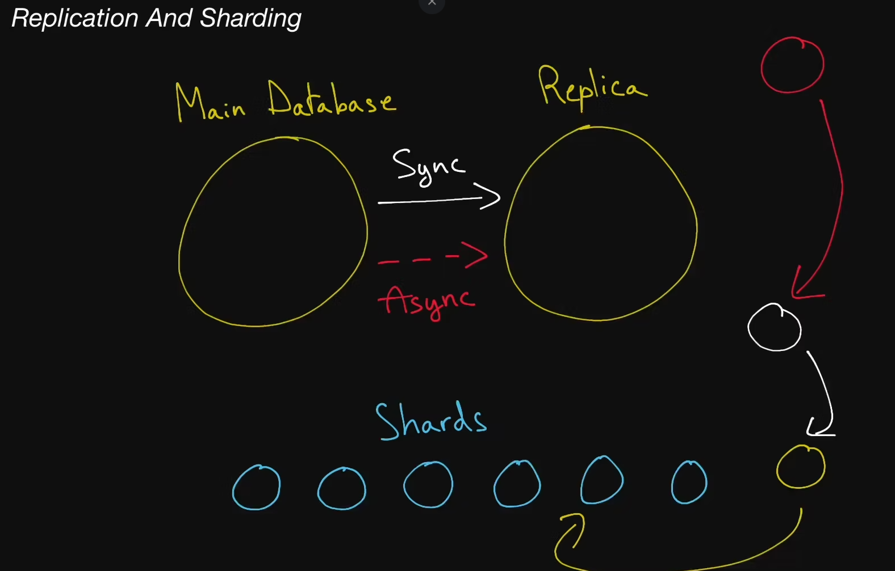

# Replication And Sharding

A system's performance is often only as good as its database's; optimize the latter, and watch as the former improves in tandem!

we'll examine how data redundancy and data partitioning techniques can be used to enhance a system's fault tolerance, throughput, and overall reliability.

## Replication

  The act of duplicating the data from one database server to others. This
  is sometimes used to increase the redundancy of your system and
  tolerate regional failures for instance. Other times you can use
  replication to move data closer to your clients, thus decreasing
  the latency of accessing specific data.

## Sharding

  Sometimes called <b>data partitioning</b>, sharding is the
  act of splitting a database into two or more pieces called
  <b>shards</b> and is typically done to increase the throughput
  of your database. Popular sharding strategies include:

  Sharding based on a client's region
  Sharding based on the type of data being stored (e.g: user data gets
      stored in one shard, payments data gets stored in another
      shard)
  Sharding based on the hash of a column (only for structured
      data)

## Hot Spot

  When distributing a workload across a set of servers, that workload might be
  spread unevenly. This can happen if your <b>sharding key</b> or your <b>hashing function</b>
  are suboptimal, or if your workload is naturally skewed: some servers will
  receive a lot more traffic than others, thus creating a "hot spot".
