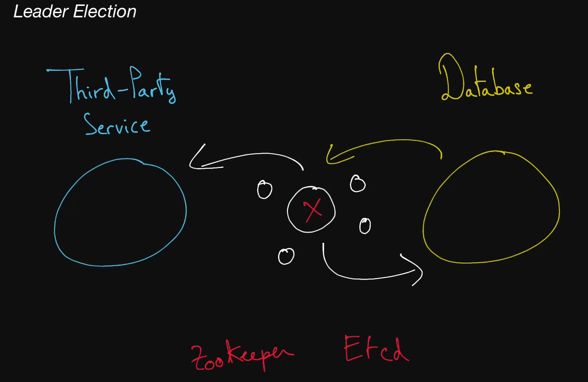

# Leader Election

  Citizens in a society typically elect a leader by voting for their preferred candidate. But how do servers in a distributed system choose a master node? Via algorithms of course!

  This form of algorithmic democracy is known as "leader election", though we personally think "algorithmocracy" sounds way cooler.

  The process by which nodes in a cluster (for instance, servers in a set of
  servers) elect a so-called "leader" amongst them, responsible for the primary
  operations of the service that these nodes support. When correctly
  implemented, leader election guarantees that all nodes in the cluster know
  which one is the leader at any given time and can elect a new leader if the
  leader dies for whatever reason.

## Consensus Algorithm

  A type of complex algorithms used to have multiple entities agree on a single
  data value, like who the "leader" is amongst a group of machines. Two popular
  consensus algorithms are <b>Paxos</b> and <b>Raft</b>.

## Paxos &amp; Raft

  Two consensus algorithms that, when implemented correctly, allow for the
  synchronization of certain operations, even in a distributed setting.

## Etcd

  Etcd is a strongly consistent and highly available key-value store that's
  often used to implement leader election in a system.

## ZooKeeper

  ZooKeeper is a strongly consistent, highly available key-value store. It's
  often used to store important configuration or to perform leader election.

## Helpful links

* [pip install etcd3](https://pypi.org/project/etcd3/)
