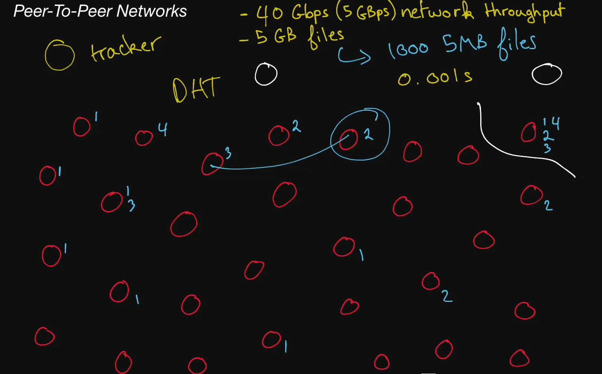

# Peer-To-Peer Networks

  Equality for all.
  Sharing is caring.
  Unity makes strength.
  The more the merrier.
  Teamwork makes the dream work.
  Welcome to peer-to-peer networks!

  A collection of machines referred to as peers that divide a workload between
  themselves to presumably complete the workload faster than would otherwise be
  possible. Peer-to-peer networks are often used in file-distribution systems.

## Gossip Protocol

  When a set of machines talk to each other in a uncoordinated manner in a
  cluster to spread information through a system without requiring a central
  source of data.

## Helpful links

* [Kraken](https://github.com/uber/kraken)

# Note

    40 Gbps is a data rate meaning that 40 giga (1024*1024*1024 = 1,073,741,824) bits can be transmitted per second.

    A bit in information theory is either a 0 or a 1. A byte (ignoring parity and encoding) contains 8 bits.

    o 40 gigabits per second (usually abbreviated Gbps) = 5 gigabytes per second (usually abbreviated GBps).
