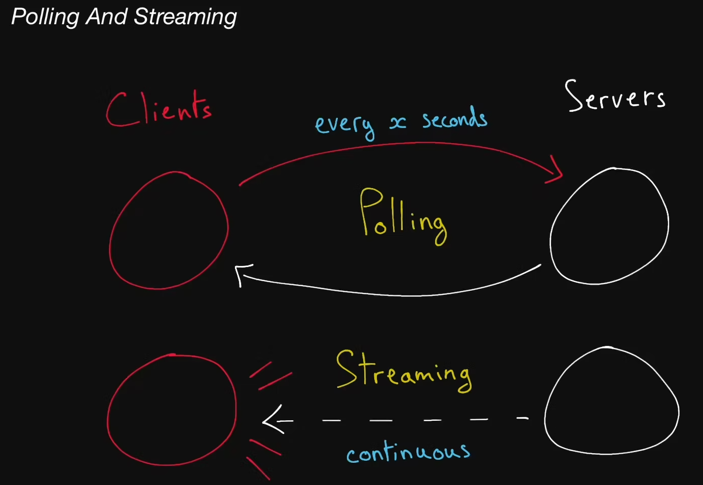

# Polling And Streaming

  You can think of polling and streaming kind of like a classroom; sometimes students ask the teacher lots of questions, and other times they quiet down and listen attentively to the  teacher's lecture.

## Polling

  The act of fetching a resource or piece of data regularly at an interval to
  make sure your data is not too stale.

## Streaming

  In networking, it usually refers to the act of continuously getting a feed of
  information from a server by keeping an open connection between the two
  machines or processes.
