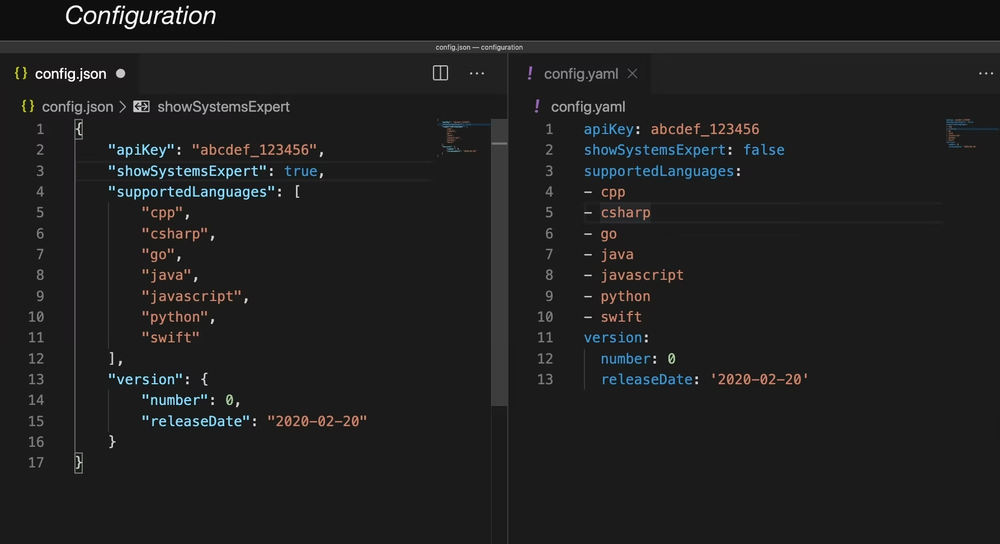

# Configuration

  The config file is like the genome of a computer application; it stores parameters that define your system's critical settings, much like your DNA stores the genes that define your physical characteristics.

  Unlike its biological counterpart though, the config file is easily editable. No gene therapy needed!

  A set of parameters or constants that are critical to a system. Configuration
  is typically written in <b>JSON</b> or <b>YAML</b> and can be either <b>static</b>, meaning
  that it's hard-coded in and shipped with your system's application code (like
  frontend code, for instance), or <b>dynamic</b>, meaning that it lives outside
  of your system's application code.

