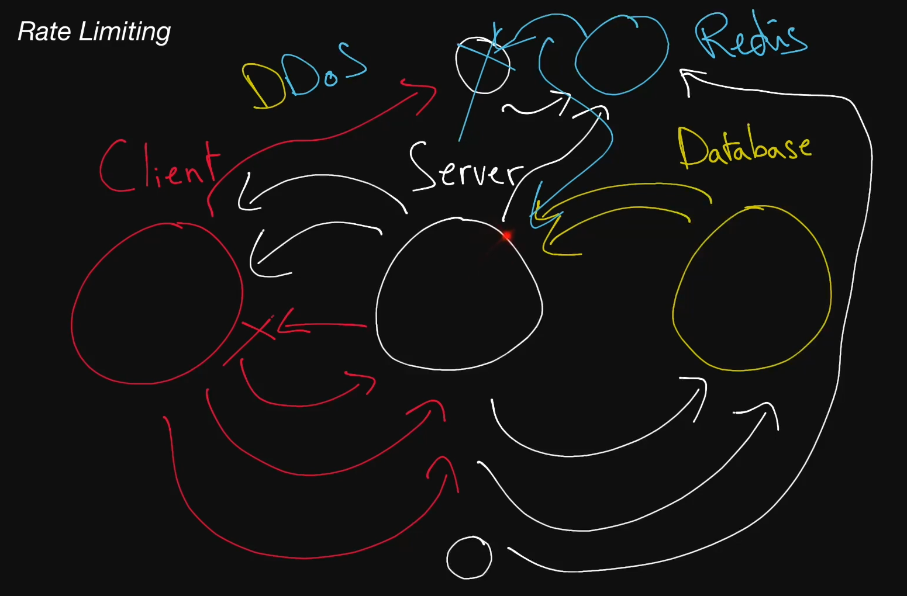

# Rate Limiting

  The act of limiting the number of requests sent to or from a system. Rate
  limiting is most often used to limit the number of incoming requests in order
  to prevent <b>DoS attacks</b> and can be enforced at the IP-address level, at the
  user-account level, or at the region level, for example. Rate limiting can
  also be implemented in tiers; for instance, a type of network request could be
  limited to 1 per second, 5 per 10 seconds, and 10 per minute.

## DoS Attack

  Short for "denial-of-service attack", a DoS attack is an attack in which a
  malicious user tries to bring down or damage a system in order to render it
  unavailable to users. Much of the time, it consists of flooding it with
  traffic. Some DoS attacks are easily preventable with rate limiting, while
  others can be far trickier to defend against.

## DDoS Attack

  Short for "distributed denial-of-service attack", a DDoS attack is a DoS
  attack in which the traffic flooding the target system comes from many
  different sources (like thousands of machines), making it much harder to
  defend against.

## Redis

  An in-memory key-value store. Does offer some persistent storage options but is
  typically used as a really fast, best-effort caching solution. Redis is also often
  used to implement <b>rate limiting</b>.
