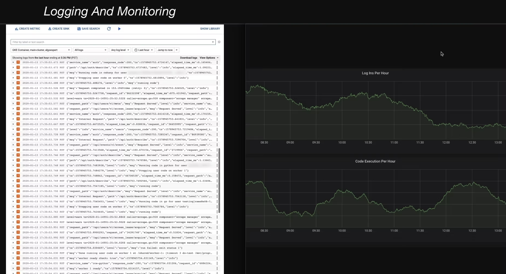

# Logging And Monitoring

  In order to properly understand and diagnose issues that crop up within a system, it’s critical to have mechanisms in place that create audit trails of various events that occur within said system.

## Logging

  The act of collecting and storing logs--useful information about events in
  your system. Typically your programs will output log messages to its STDOUT
  or STDERR pipes, which will automatically get aggregated into a <b>centralized
  logging solution</b>.

## Monitoring

  The process of having visibility into a system's key metrics, monitoring is
  typically implemented by collecting important events in a system and
  aggregating them in human-readable charts.

## Alerting

  The process through which system administrators get notified when critical
  system issues occur. Alerting can be set up by defining specific thresholds
  on monitoring charts, past which alerts are sent to a communication channel
  like Slack.
