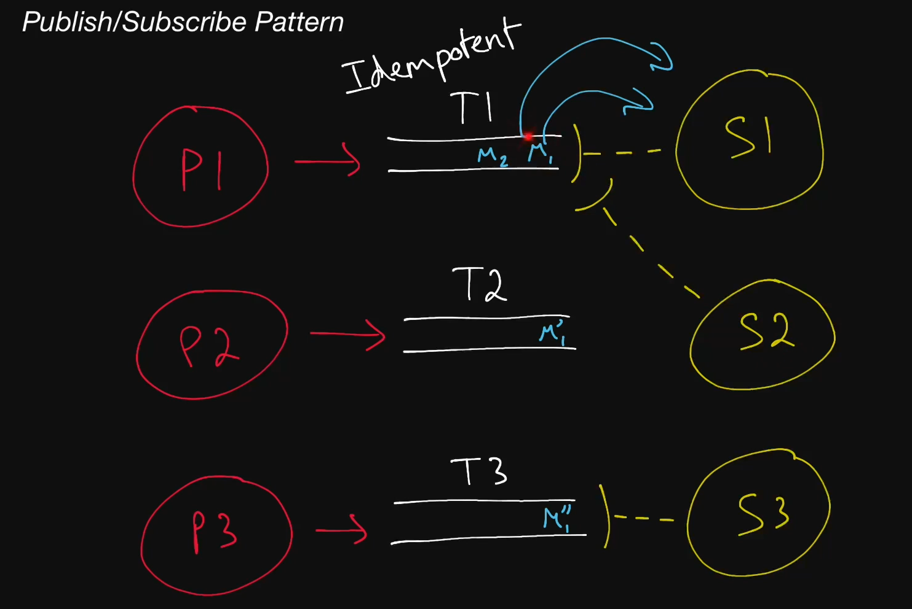

# Publish/Subscribe Pattern

  Publish/Subscribe. Press/Tug. Produce/Consume. Push/Pull. Send/Receive. Throw/Catch. Thrust/Retrieve.

  Three of these can be used interchangeably in the context of systems design. The others cannot.

  Often shortened as <b>Pub/Sub</b>, the Publish/Subscribe pattern is a popular
  messaging model that consists of <b>publishers</b> and <b>subscribers</b>.
  Publishers publish messages to special <b>topics</b> (sometimes called
  <b>channels</b>) without caring about or even knowing who will read those
  messages, and subscribers subscribe to topics and read messages coming through
  those topics.

  Pub/Sub systems often come with very powerful guarantees like
  <b>at-least-once delivery</b>, <b>persistent storage</b>,
  <b>ordering</b> of messages, and <b>replayability</b> of messages.

## Idempotent Operation

  An operation that has the same ultimate outcome regardless of how many times
  it's performed. If an operation can be performed multiple times without
  changing its overall effect, it's idempotent. Operations performed through a
  <b>Pub/Sub</b> messaging system typically have to be idempotent, since Pub/Sub
  systems tend to allow the same messages to be consumed multiple times.

  For example, increasing an integer value in a database is <i>not</i> an
  idempotent operation, since repeating this operation will not have the same
  effect as if it had been performed only once. Conversely, setting a value to
  "COMPLETE" <i>is</i> an idempotent operation, since repeating this operation
  will always yield the same result: the value will be "COMPLETE".

## Apache Kafka

  A distributed messaging system created by LinkedIn. Very useful
  when using the <b>streaming</b> paradigm as opposed to <b>polling</b>.

## Cloud Pub/Sub

  A highly-scalable Pub/Sub messaging service created by Google. Guarantees
  <b>at-least-once delivery</b> of messages and supports "rewinding" in order to
  reprocess messages.
