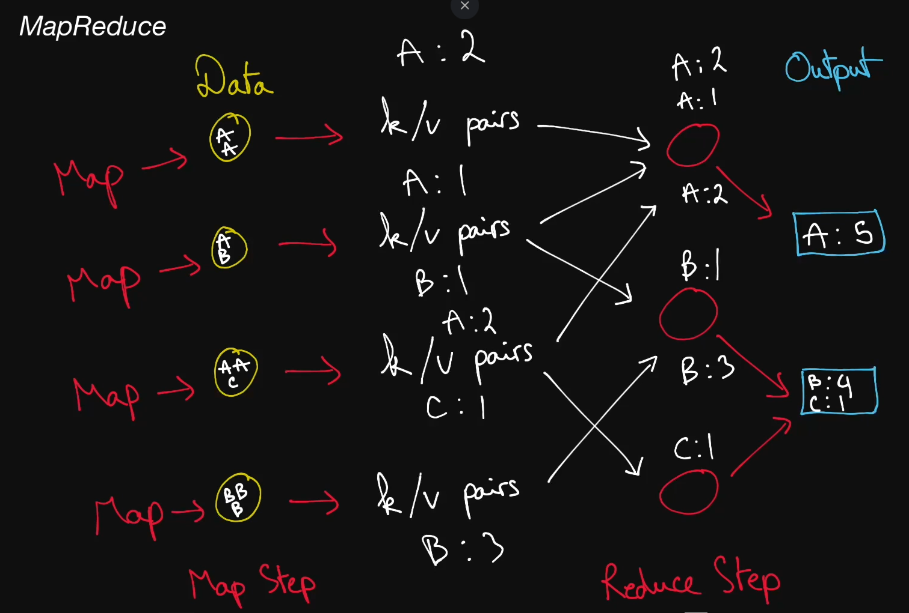

# MapReduce

  "MapReduce is a programming model for processing and generating big data sets with a parallel, distributed algorithm on a cluster."

  A popular framework for processing very large datasets in a distributed
  setting efficiently, quickly, and in a fault-tolerant manner. A MapReduce job
  is comprised of 3 main steps:

    the <b>Map</b> step, which runs a <b>map function</b> on the various chunks
    of the dataset and transforms these chunks into intermediate
    <b>key-value pairs</b>.

    the <b>Shuffle</b> step, which reorganizes the intermediate
    <b>key-value pairs</b> such that pairs of the same key are routed
    to the same machine in the final step.

    the <b>Reduce</b> step, which runs a <b>reduce function</b> on the newly
    shuffled <b>key-value pairs</b> and transforms them into more meaningful
    data.

  The canonical example of a MapReduce use case is counting the number of
  occurrences of words in a large text file.

  When dealing with a MapReduce library, engineers and/or systems administrators
  only need to worry about the map and reduce functions, as well as their inputs
  and outputs. All other concerns, including the parallelization of tasks and
  the fault-tolerance of the MapReduce job, are abstracted away and taken care
  of by the MapReduce implementation.

## Distributed File System

  A Distributed File System is an abstraction over a (usually large) cluster of
  machines that allows them to act like one large file system. The two most
  popular implementations of a DFS are the <b>Google File System</b> (GFS) and
  the <b>Hadoop Distributed File System</b> (HDFS).

  Typically, DFSs take care of the classic <b>availability</b> and
  <b>replication</b> guarantees that can be tricky to obtain in a
  distributed-system setting. The overarching idea is that files are split into
  chunks of a certain size (4MB or 64MB, for instance), and those chunks are
  sharded across a large cluster of machines. A central control plane is in
  charge of deciding where each chunk resides, routing reads to the right nodes,
  and handling communication between machines.

  Different DFS implementations have slightly different APIs and semantics, but
  they achieve the same common goal: extremely large-scale persistent storage.

## Hadoop

  A popular, open-source framework that supports MapReduce jobs and many
  other kinds of data-processing pipelines. Its central component is <b>HDFS</b>
  (Hadoop Distributed File System), on top of which other technologies have
  been developed.
