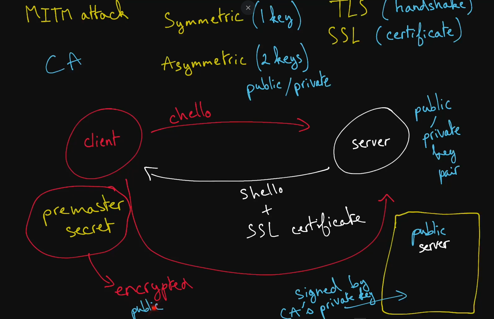

# Security And HTTPS

While network security is of critical importance to virtually any system, it's beyond the scope of most system design interviews.

That being said, having even a cursory understanding of a few key concepts could very well materialize into the edge you need to ace your interview and secure—pun perhaps intended—a job offer.

## Man-In-The-Middle Attack

  An attack in which the attacker intercepts a line of communication that is
  thought to be private by its two communicating parties.

  If a malicious actor intercepted and mutated an IP packet on its way from a
  client to a server, that would be a man-in-the-middle attack.

  MITM attacks are the primary threat that encryption and <b>HTTPS</b> aim to
  defend against.

## Symmetric Encryption

  A type of encryption that relies on only a single key to both encrypt and
  decrypt data. The key must be known to all parties involved in communication
  and must therefore typically be shared between the parties at one point or
  another.

  Symmetric-key algorithms tend to be faster than their asymmetric counterparts.

  The most widely used symmetric-key algorithms are part of the Advanced
  Encryption Standard (<b>AES</b>).

## Asymmetric Encryption

  Also known as public-key encryption, asymmetric encryption relies on two
  keys—a public key and a private key—to encrypt and decrypt data. The keys are
  generated using cryptographic algorithms and are mathematically connected such
  that data encrypted with the public key can only be decrypted with the private
  key.

  While the private key must be kept secure to maintain the fidelity of this
  encryption paradigm, the public key can be openly shared.

  Asymmetric-key algorithms tend to be slower than their symmetric counterparts.

## AES

  Stands for <b>Advanced Encryption Standard</b>. AES is a widely used
  encryption standard that has three symmetric-key algorithms (AES-128, AES-192,
  and AES-256).

  Of note, AES is considered to be the "gold standard" in encryption and is even
  used by the U.S. National Security Agency to encrypt top secret information.

## HTTPS

  The <b>H</b>yper<b>T</b>ext <b>T</b>ransfer <b>P</b>rotocol <b>S</b>ecure is
  an extension of <b>HTTP</b> that's used for secure communication online. It
  requires servers to have trusted certificates (usually
  <b>SSL certificates</b>) and uses the Transport Layer Security (<b>TLS</b>), a
  security protocol built on top of <b>TCP</b>, to encrypt data communicated
  between a client and a server.

## TLS

  The <b>T</b>ransport <b>L</b>ayer <b>S</b>ecurity is a security protocol over
  which <b>HTTP</b> runs in order to achieve secure communication online. "HTTP
  over TLS" is also known as <b>HTTPS</b>.

## SSL Certificate

  A digital certificate granted to a server by a <b>certificate authority</b>.
  Contains the server's public key, to be used as part of the
  <b>TLS handshake</b> process in an <b>HTTPS</b> connection.

  An SSL certificate effectively confirms that a public key belongs to the
  server claiming it belongs to them. SSL certificates are a crucial defense
  against <b>man-in-the-middle attacks</b>.

## Certificate Authority

  A trusted entity that signs digital certificates—namely, SSL certificates that
  are relied on in <b>HTTPS</b> connections.

## TLS Handshake

  The process through which a client and a server communicating over
  <b>HTTPS</b> exchange encryption-related information and establish a secure
  communication. The typical steps in a TLS handshake are roughly as follows:

- The client sends a client hello—a string of random bytes—to the
  server.

- The server responds with a server hello—another string of random
  bytes—as well as its SSL certificate, which contains its
  public key.

- The client verifies that the certificate was issued by a
  certificate authority and sends a premaster secret—yet another
  string of random bytes, this time encrypted with the server's public key—to
  the server.

- The client and the server use the client hello, the server hello, and the
  premaster secret to then generate the same symmetric-encryption session keys,
  to be used to encrypt and decrypt all data communicated during the remainder
  of the connection.
