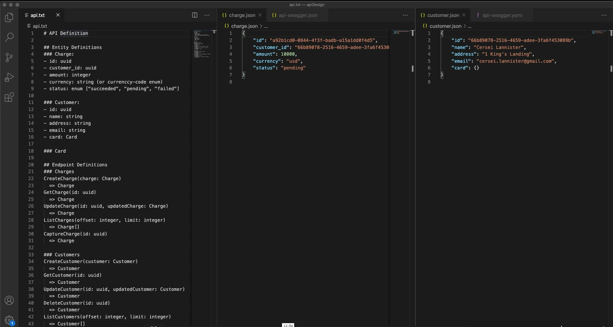

# API Design

## Pagination

  When a network request potentially warrants a really large response, the
  relevant API might be designed to return only a single <b>page</b>
  of that response (i.e., a limited portion of the response), accompanied by an
  identifier or token for the client to request the next page if desired.

  Pagination is often used when designing <b>List</b> endpoints. For instance,
  an endpoint to list videos on the YouTube Trending page could return a huge
  list of videos. This wouldn't perform very well on mobile devices due to the
  lower network speeds and simply wouldn't be optimal, since most users will
  only ever scroll through the first ten or twenty videos. So, the API could be
  designed to respond with only the first few videos of that list; in this case,
  we would say that the API response is <b>paginated</b>.

## CRUD Operations

  Stands for <b>Create</b>, <b>Read</b>, <b>Update</b>,
  <b>Delete</b> Operations. These four operations often serve as the bedrock of a
  functioning system and therefore find themselves at the core of many APIs.
  The term <b>CRUD</b> is very likely to come up during an API-design interview.
